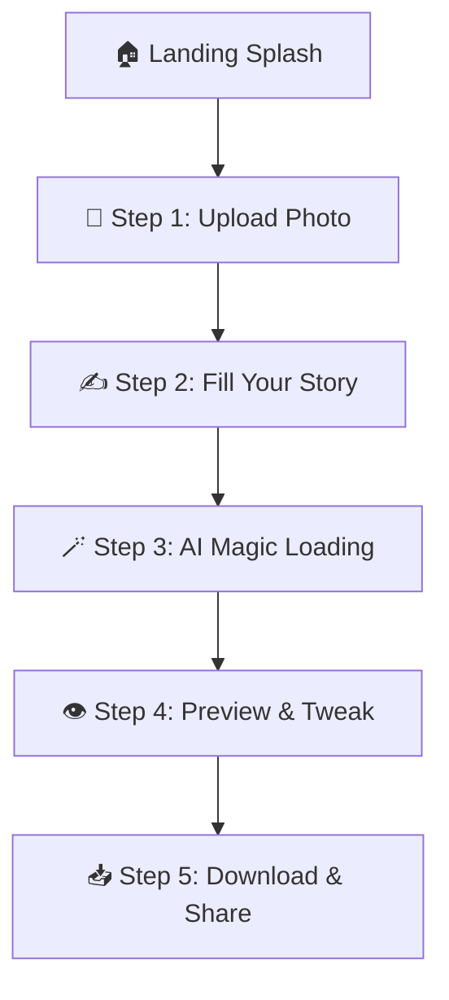

# PromptAgro - AI-Powered Agri-Packaging Platform

Transform your farm products into premium brands with AI-powered packaging design.

## 🌟 Features

- **📸 Smart Upload**: Drag & drop product photos with instant preview
- **✍️ Story Builder**: Capture your product's unique story and branding
- **🪄 AI Magic**: Generate custom packaging designs using AI
- **👁️ Live Preview**: Real-time customization with instant feedback
- **📥 Multi-Format Export**: Download PDF reports, high-res mockups, and print-ready files
- **🌍 Multilingual**: Support for English, Swahili, and French
- **📱 Mobile-First**: Responsive design for all devices

## 🚀 **QUICK DEPLOYMENT**

### **Option 1: Deploy to Render.com (Recommended)**
[](https://render.com)

1. Push to GitHub: `git push origin main`
2. Go to [Render.com](https://render.com)
3. Create Web Service from your GitHub repo
4. Add `GEMINI_API_KEY` environment variable
5. Deploy! ✨

**👉 [Full Render Deployment Guide](RENDER_DEPLOY.md)**

### **Option 2: Deploy to Heroku**
[](https://heroku.com/deploy)

1. Click the button above  
2. Add your `GEMINI_API_KEY`
3. Deploy!

### **Option 3: Manual Deployment**
```bash
# Clone and setup
git clone https://github.com/yourusername/PROMPT-AGRO
cd PROMPT-AGRO

# Run deployment script
./deploy.sh    # Linux/Mac
deploy.bat     # Windows
```

## 🏗️ Project Structure

```
frontend/
├── index.html              # Main HTML entry point (67 lines)
├── css/
│   ├── main.css            # Core styles and layout (65 lines)
│   ├── components.css      # Reusable UI components (69 lines)
│   ├── wizard.css          # Wizard-specific styles (66 lines)
│   ├── upload.css          # Upload and form styles (70 lines)
│   └── responsive.css      # Mobile and responsive styles (67 lines)
├── js/
│   ├── app.js              # Main application controller (70 lines)
│   ├── state.js            # Global state management (68 lines)
│   ├── i18n.js             # Internationalization module (69 lines)
│   ├── components.js       # Reusable UI components (70 lines)
│   ├── wizard.js           # Wizard step management (70 lines)
│   └── api.js              # API communication layer (70 lines)
├── i18n/
│   ├── en.json             # English translations
│   ├── sw.json             # Swahili translations
│   └── fr.json             # French translations
└── assets/                 # Images and media files
```

## 🚀 Getting Started

### Prerequisites
- Modern web browser
- Local web server (optional for development)

### Installation

1. **Clone the repository**
   ```bash
   git clone <repository-url>
   cd PROMPT-AGRO/frontend
   ```

2. **Serve the files**
   ```bash
   # Using Python
   python -m http.server 8000
   
   # Using Node.js
   npx serve .
   
   # Using PHP
   php -S localhost:8000
   ```

3. **Open in browser**
   ```
   http://localhost:8000
   ```

## 🎯 User Flow



## 🔧 Code Architecture

### Modular Design
- **Each file under 70 lines** for maximum readability
- **Separation of concerns** with dedicated modules
- **Event-driven architecture** using state management
- **Component-based UI** for reusability

### State Management
- Centralized state in `state.js`
- Observer pattern for reactive updates
- Immutable state updates

### Internationalization
- JSON-based translation files
- Dynamic language switching
- Locale-aware formatting

### API Integration
- Mock API for frontend development
- Ready for backend integration
- Error handling and retry logic

## 🎨 Styling

### CSS Architecture
- **CSS Custom Properties** for theming
- **Mobile-first** responsive design
- **Component-based** styling
- **Smooth animations** and transitions

### Design System
- **Primary**: Green (`#2E7D32`)
- **Secondary**: Orange (`#FFA726`)
- **Accent**: Red-Orange (`#FF6B35`)
- **Typography**: Inter + Playfair Display

## 🌍 Internationalization

Currently supports:
- 🇬🇧 **English** (en)
- 🇸🇿 **Swahili** (sw)
- 🇫🇷 **French** (fr)

### Adding New Languages

1. Create translation file: `i18n/[language-code].json`
2. Add option to language selector in `index.html`
3. Update locale mapping in `i18n.js`

## 📱 Browser Support

- Chrome 70+
- Firefox 65+
- Safari 12+
- Edge 79+

## 🚀 Performance

- **Lazy loading** for non-critical resources
- **Optimized images** and assets
- **Minimal JavaScript** bundle size
- **CSS animations** using transforms

## 🔗 Backend Integration

The frontend is ready for backend integration:

1. Update `baseURL` in `api.js`
2. Remove mock API responses
3. Handle real API endpoints
4. Add authentication if needed

## 📈 Future Enhancements

- [ ] Offline support with Service Workers
- [ ] Advanced color palette generator
- [ ] Social media integration
- [ ] User account management
- [ ] Design templates library
- [ ] A/B testing for layouts

## 🤝 Contributing

1. Follow the 70-line rule per file
2. Maintain modular architecture
3. Add translations for new features
4. Test on multiple devices
5. Keep accessibility in mind

## 📄 License

This project is licensed under the MIT License.

---

**Built with ❤️ for farmers worldwide** 🌾
